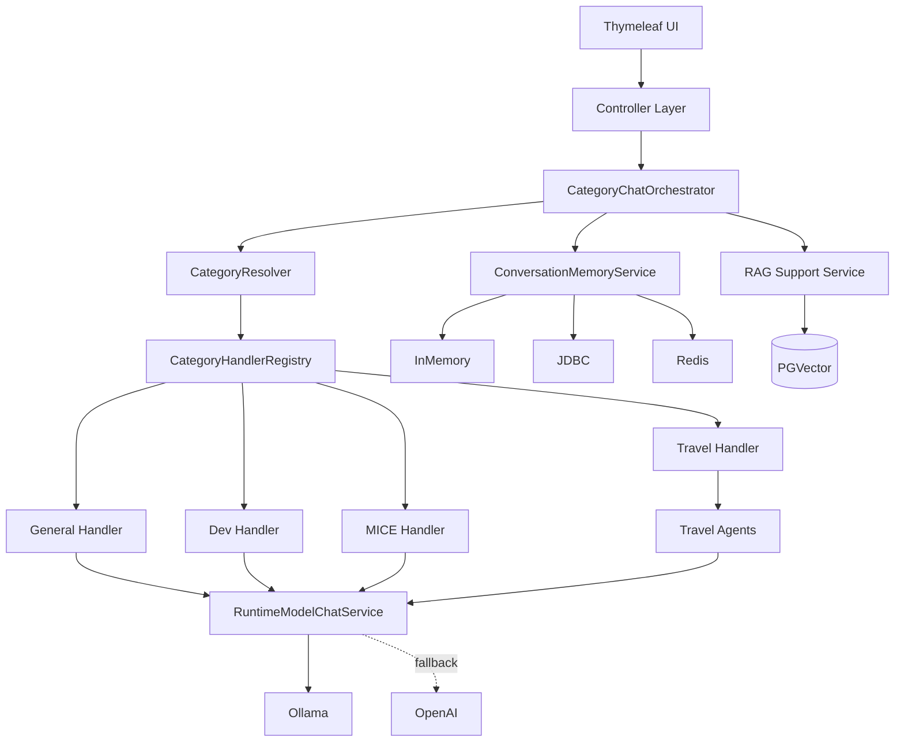

# Nalbbun AI Local

Spring Boot 4 + Spring AI 기반의 로컬 AI 통합 애플리케이션입니다.  
일반 대화, 개발 보조, MICE 기획 지원, 여행 플래닝, RAG 검색, 운영/디버그 기능을 하나의 웹 애플리케이션으로 구성한 프로젝트입니다.

이 프로젝트는 실제 소스 구조를 기준으로 정리되었으며, 본 README는 `README`, `README-DEVRAG2.md`, 기타 `.md` 설명 파일을 참조하지 않고 작성되었습니다.

---

## 1. 프로젝트 개요

### 핵심 목적
- 다양한 업무 유형을 **카테고리 기반 AI 대화**로 처리
- **Ollama / OpenAI** 모델을 상황에 따라 선택 또는 보조 활용
- 문서 업로드/URL 수집 기반 **RAG 검색형 응답** 지원
- 메모리 저장, 런타임 설정 변경, 디버그 도구를 통한 **운영형 AI 애플리케이션** 구현

### 지원 카테고리
- **GENERAL**: 일반 질의응답
- **DEV**: 개발/코드/기술 질의
- **MICE**: 행사/기획/운영 성격의 질의
- **TRAVEL**: 여행 탐색/계획/예산/일정 구성

### 주요 기술 스택
- Java 21
- Spring Boot 4.0.3
- Spring AI 2.0.0-M2
- Thymeleaf
- PostgreSQL + PGVector
- Redis
- Ollama
- OpenAI
- Apache POI / JSoup / PDF / Markdown Reader

---

## 2. 주요 기능

### 2.1 카테고리 기반 대화 처리
사용자 질문을 카테고리로 분류한 뒤, 카테고리별 파서/핸들러/프롬프트 정책으로 응답을 생성합니다.

### 2.2 모델 런타임 선택
카테고리별 기본 모델을 분리하여 사용합니다.
예시 기본값:
- General: `gemma2:9b`
- Dev: `qwen2.5-coder:14b`
- MICE: `exaone3.5:7.8b`
- Travel Search: `gemma2:9b`
- Travel Plan: `exaone3.5:7.8b`

### 2.3 외부 LLM 폴백 정책
Ollama 실패 시 OpenAI 사용 여부를 정책으로 제어합니다.
- `ALLOW_OPENAI`
- `BLOCK_OPENAI`

### 2.4 대화 메모리 저장소 지원
메모리 저장 방식을 선택할 수 있습니다.
- In-Memory
- JDBC
- Redis

### 2.5 RAG 검색 기능
문서/파일/URL을 인제스트하여 벡터 저장소(PGVector)에 적재하고, 검색 결과를 프롬프트에 주입해 응답 품질을 높입니다.

### 2.6 Travel Agent 워크플로우
여행 카테고리는 단일 응답이 아니라 다단계 에이전트 구조로 구성됩니다.
- 관광지 탐색
- 식당 탐색
- 숙소 탐색
- 예산 계산
- 일정 구성

### 2.7 운영/디버그 콘솔
운영 중 다음 항목을 확인/수정할 수 있습니다.
- 메모리 조회/삭제
- Ollama 연결 정보 및 모델 관리
- 런타임 설정 변경
- 웹 검색 디버그
- RAG 상태/인덱스/트레이스/재색인/삭제

---

## 3. 화면 및 메뉴 구성

| 메뉴 | 경로 | 설명 |
|---|---|---|
| 홈 | `/` | 일반 대화 메인 화면 |
| Agent | `/agent` | 에이전트 기능 진입 화면 |
| RAG | `/rag` | RAG 관련 화면 |
| Chat RAG | `/chat/rag` | RAG 채팅 화면 |
| Chat Agent | `/chat/agent` | Agent 채팅 화면 |
| Settings | `/settings` | 런타임 설정 화면 |
| Debug | `/debug` | 디버그 콘솔 홈 |

---

## 4. API / 엔드포인트 요약

### 4.1 채팅/운영 API
| Method | Path | 설명 |
|---|---|---|
| GET | `/api/chat/stream` | SSE 기반 채팅 스트리밍 |
| GET | `/api/runtime/ollama` | 현재 Ollama 연결 정보 조회 |

### 4.2 Debug API
| Method | Path | 설명 |
|---|---|---|
| GET | `/debug/api/memory` | 메모리 조회 |
| POST | `/debug/api/memory/clear` | 메모리 초기화 |
| GET | `/debug/api/ollama/connection` | Ollama 연결 조회 |
| POST | `/debug/api/ollama/connection` | Ollama 연결 수정 |
| POST | `/debug/api/ollama/connection/reset` | Ollama 연결 초기화 |
| GET | `/debug/api/ollama/models` | 모델 목록 조회 |
| POST | `/debug/api/ollama/models/action` | 모델 액션 실행 |
| GET | `/debug/api/ollama/config` | Ollama 설정 조회 |
| POST | `/debug/api/ollama/config` | Ollama 설정 수정 |
| POST | `/debug/api/ollama/config/reset` | Ollama 설정 초기화 |
| GET | `/debug/api/config` | 런타임 설정 조회 |
| POST | `/debug/api/config` | 런타임 설정 수정 |
| POST | `/debug/api/config/reset` | 런타임 설정 초기화 |
| GET | `/debug/api/search` | 검색 디버그 |
| GET | `/debug/api/search/fetch` | 검색 결과 상세 조회 |

### 4.3 RAG Debug API
| Method | Path | 설명 |
|---|---|---|
| GET | `/debug/api/rag/status` | RAG 상태 확인 |
| GET | `/debug/api/rag/db-info` | RAG DB 정보 조회 |
| GET | `/debug/api/rag/search` | RAG 검색 테스트 |
| GET | `/debug/api/rag/sources` | 소스 목록 조회 |
| GET | `/debug/api/rag/source/files` | 소스별 파일 조회 |
| POST | `/debug/api/rag/source/purge` | 소스 단위 삭제 |
| POST | `/debug/api/rag/source/file/purge` | 파일 단위 삭제 |
| POST | `/debug/api/rag/source/reindex` | 소스 재색인 |
| GET | `/debug/api/rag/source/compare` | 소스 버전 비교 |
| GET | `/debug/api/rag/traces` | RAG 트레이스 목록 |
| GET | `/debug/api/rag/traces/{traceId}` | RAG 트레이스 상세 |
| POST | `/debug/api/rag/traces/clear` | 트레이스 삭제 |
| POST | `/debug/api/rag/ingest-text` | 텍스트 인제스트 |
| POST | `/debug/api/rag/ingest-file` | 파일 1건 인제스트 |
| POST | `/debug/api/rag/ingest-files` | 다중 파일 인제스트 |
| POST | `/debug/api/rag/ingest-url` | URL 인제스트 |
| POST | `/debug/api/rag/config` | RAG 설정 수정 |

---

## 5. 전체 아키텍처



---

## 6. 요청 처리 흐름

### 6.1 일반 대화 흐름
1. 사용자가 질문 입력
2. `ChatController`가 SSE 스트림 시작
3. `CategoryChatOrchestrator`가 전체 흐름 제어
4. `CategoryResolver`가 질문 카테고리 판별
5. `CategoryHandlerRegistry`가 해당 핸들러 선택
6. 카테고리 핸들러가 파싱/프롬프트 구성
7. `RuntimeModelChatService`가 모델 선택 후 응답 생성
8. 메모리 저장 및 SSE 이벤트 반환

### 6.2 RAG 응답 흐름
1. 문서/파일/URL 인제스트
2. 문서 리더가 본문 추출
3. 청크 분할 및 메타데이터 생성
4. PGVector 저장
5. 질의 시 유사 문서 검색
6. 검색 문맥을 프롬프트에 결합
7. LLM 응답 생성

### 6.3 Travel Agent 흐름
1. 여행 요청 입력
2. 여행 카테고리로 분류
3. 검색/추천/예산/일정 전용 Agent 순차 실행
4. 중간 결과를 종합
5. 최종 여행 제안 응답 생성

---

## 7. 주요 패키지 구조

```text
ai.local.nalbbun
├─ category                # 카테고리별 파서/핸들러/컨텍스트
│  ├─ common
│  ├─ general
│  ├─ dev
│  ├─ mice
│  └─ travel
├─ config                  # Spring 설정 클래스
├─ controller              # 페이지 컨트롤러
├─ controller.api          # 채팅/API 컨트롤러
├─ debug                   # 디버그 기능
├─ model                   # 공통 모델
├─ orchestrator            # 전체 대화 오케스트레이션
├─ port                    # 외부 포트 인터페이스
├─ rag                     # RAG 인제스트/검색/관리
├─ registry                # 핸들러 레지스트리
├─ service                 # 대화/LLM/메모리/프롬프트/검색 서비스
└─ support                 # SSE 등 보조 유틸리티
```

### 패키지별 역할 요약
- `category.common`: 카테고리 판별 공통 로직, 파서 인터페이스, 응답 생성 공통부
- `category.general|dev|mice|travel`: 도메인별 파서/핸들러/컨텍스트
- `orchestrator`: 전체 요청 흐름 제어
- `service.llm`: 런타임 모델 선택, LLM 호출, 폴백 정책
- `service.memory`: 대화 메모리 저장/조회 구현체
- `service.search`: 검색 Provider 구현체
- `rag.*`: 인제스트, 검색, 재색인, 비교, 트레이스 등 RAG 전반
- `debug.*`: 운영자용 설정/상태 확인/수정 기능

---

## 8. 주요 핵심 클래스

### 진입점
- `NalbbunAiLocalApplication`

### 컨트롤러
- `HomeController`
- `AgentPageController`
- `RagPageController`
- `SettingsController`
- `ChatController`
- `RuntimeInfoController`

### 오케스트레이션/레지스트리
- `CategoryChatOrchestrator`
- `CategoryHandlerRegistry`
- `CategoryResolver`
- `CategoryResponseGenerator`

### 메모리
- `ConversationMemoryService`
- `InMemoryConversationMemoryService`
- `JdbcConversationMemoryService`
- `RedisConversationMemoryService`

### LLM
- `RuntimeModelResolver`
- `RuntimeModelChatService`
- `RuntimeModelSelection`
- `ExternalLlmFallbackPolicy`

### 검색
- `DummyWebSearchService`
- `TavilyWebSearchService`

### RAG
- `RagDocumentIngestionService`
- `RagDocumentReaderService`
- `RagDocumentRetriever`
- `RagSupportService`
- `RagPromptComposer`
- `RagSourceAdminService`
- `RagSourceCatalogService`
- `RagSourceRegistryService`
- `DebugRagTraceService`

### Travel Agent
- `TravelAttractionAgent`
- `TravelRestaurantAgent`
- `TravelAccommodationAgent`
- `TravelBudgetAgent`
- `TravelPlanAgent`

---

## 9. 실행 환경

### 필수 요구사항
- JDK 21
- Gradle Wrapper
- PostgreSQL 16 이상 권장
- Redis 7 이상 권장
- Ollama
- 선택: OpenAI API Key
- 선택: Tavily API Key

### 기본 포트
- Application: `8080`
- PostgreSQL: `5432`
- Redis: `6379`
- Ollama: `11434`

---

## 10. 빠른 시작

### 10.1 인프라 구동
프로젝트의 `docker/` 디렉터리 기준:

```bash
cd docker
docker compose -f docker-compose.infra.yml up -d
```

### 10.2 Ollama 준비
예시:

```bash
ollama serve
ollama pull gemma2:9b
ollama pull qwen2.5-coder:14b
ollama pull exaone3.5:7.8b
ollama pull nomic-embed-text
```

### 10.3 애플리케이션 실행
프로젝트 루트 기준:

```bash
./gradlew bootRun
```

실행 후 접속:
- `http://localhost:8080/`

---

## 11. 프로파일 및 설정

### 기본 프로파일
`application.yaml` 기준 기본 활성 프로파일은 다음과 같습니다.

```yaml
spring:
  profiles:
    active: ${SPRING_PROFILES_ACTIVE:local}
```

### local 프로파일 특징
- Debug 활성화
- LLM 폴백 정책 기본값: `ALLOW_OPENAI`
- Memory Store 기본값: `in-memory`
- Search Provider 기본값: `dummy`

### prod 프로파일 특징
- Debug 비활성화
- LLM 폴백 정책 기본값: `BLOCK_OPENAI`
- Memory Store 기본값: `jdbc`

---

## 12. 주요 환경변수

### 모델/LLM
| 변수 | 기본값 | 설명 |
|---|---|---|
| `OPENAI_API_KEY` | 빈 값 | OpenAI API Key |
| `OPENAI_MODEL` | `gpt-4.1-mini` | OpenAI 기본 모델 |
| `OLLAMA_BASE_URL` | `http://127.0.0.1:11434` | Ollama 주소 |
| `OLLAMA_MODEL` | `gemma2:9b` | 기본 Ollama 채팅 모델 |
| `OLLAMA_EMBEDDING_MODEL` | `nomic-embed-text` | 임베딩 모델 |

### 애플리케이션 정책
| 변수 | 기본값 | 설명 |
|---|---|---|
| `APP_DEBUG_ENABLED` | `true` | 디버그 기능 활성화 |
| `APP_LLM_FALLBACK_POLICY` | `BLOCK_OPENAI` 또는 profile별 override | 외부 LLM 폴백 정책 |
| `APP_MEMORY_STORE` | `jdbc` 또는 profile별 override | 메모리 저장소 유형 |
| `APP_SEARCH_PROVIDER` | `tavily` 또는 profile별 override | 검색 제공자 |

### RAG
| 변수 | 기본값 | 설명 |
|---|---|---|
| `APP_RAG_ENABLED` | `true` | RAG 사용 여부 |
| `APP_RAG_VECTOR_STORE` | `pgvector` | 벡터 저장소 |
| `APP_RAG_TOP_K` | `4` | 검색 문서 수 |
| `APP_RAG_SIMILARITY_THRESHOLD` | `0.72` | 유사도 임계치 |
| `APP_RAG_GENERAL_ENABLED` | `false` | GENERAL 카테고리 RAG |
| `APP_RAG_DEV_ENABLED` | `true` | DEV 카테고리 RAG |
| `APP_RAG_MICE_ENABLED` | `true` | MICE 카테고리 RAG |
| `APP_RAG_TRAVEL_ENABLED` | `false` | TRAVEL 카테고리 RAG |

### 데이터 저장소
| 변수 | 기본값 | 설명 |
|---|---|---|
| `SPRING_DATASOURCE_URL` | 환경별 상이 | PostgreSQL 연결 문자열 |
| `SPRING_DATASOURCE_USERNAME` | `nalbbun` | DB 사용자 |
| `SPRING_DATASOURCE_PASSWORD` | 환경별 상이 | DB 비밀번호 |
| `SPRING_DATA_REDIS_HOST` | 환경별 상이 | Redis 호스트 |
| `SPRING_DATA_REDIS_PORT` | `6379` | Redis 포트 |

---

## 13. 데이터 저장 구조

### PostgreSQL
- 일반 JDBC 메모리 저장소 사용 시 대화 메모리 저장
- PGVector 사용 시 임베딩/문서 검색 저장소 역할 수행

### Redis
- Redis 메모리 저장소 사용 시 대화 메모리 캐시/저장소 역할 수행

### 초기 SQL
- `docker/postgres/init/00-pgvector-extensions.sql`
- `docker/postgres/init/01-memory-schema.sql`

---

## 14. RAG 지원 범위

### 입력 소스
- 텍스트 직접 입력
- 단일 파일
- 다중 파일
- URL

### 내부 처리 구성
- 파일 유형 판별: `RagFileTypeDetector`
- 문서 읽기: `RagDocumentReaderService`
- 인제스트: `RagDocumentIngestionService`
- 검색: `RagDocumentRetriever`
- 프롬프트 구성: `RagPromptComposer`
- 관리/정리/재색인: `RagSourceAdminService`

### 운영 기능
- 소스 목록 조회
- 파일별 조회
- 삭제
- 재색인
- 버전 비교
- 트레이스 조회

---

## 15. 디버그/운영 기능

운영자는 `/debug` 하위 기능을 통해 다음을 수행할 수 있습니다.

- 현재 메모리 상태 조회 및 전체 초기화
- Ollama 연결 주소와 모델 설정 수정
- 런타임 설정 변경/초기화
- 검색 공급자 테스트
- RAG 인제스트/상태/검색 결과/트레이스 확인

운영 관점에서 이 프로젝트의 강점은 **설정값을 코드 변경 없이 런타임에서 확인하고 조정할 수 있는 구조**에 있습니다.

---

## 16. 개발 시 확인 포인트

### 16.1 채팅 응답이 안 나올 때
1. Ollama 서버 구동 여부 확인
2. 모델이 실제로 존재하는지 확인
3. `/api/runtime/ollama` 또는 `/debug/api/ollama/*`로 연결 상태 점검
4. 폴백 정책이 `BLOCK_OPENAI`인지 확인
5. OpenAI Key 설정 여부 확인

### 16.2 RAG 검색이 비어 있을 때
1. `APP_RAG_ENABLED` 확인
2. 대상 카테고리의 RAG 사용 여부 확인
3. PGVector 스키마 및 DB 연결 확인
4. 문서 인제스트 성공 여부 확인
5. similarity threshold가 너무 높지 않은지 확인

### 16.3 메모리가 저장되지 않을 때
1. `APP_MEMORY_STORE` 값 확인
2. JDBC 사용 시 DB 스키마 확인
3. Redis 사용 시 접속 정보 확인
4. local/profile override로 다른 저장소가 적용되지 않았는지 확인

---

## 17. 테스트 및 빌드

### 테스트
```bash
./gradlew test
```

### 빌드
```bash
./gradlew build
```

### 실행 JAR 생성
```bash
./gradlew bootJar
```

---

## 18. 추천 운영 방식

### 개발 환경
- Profile: `local`
- Memory: `in-memory`
- Search Provider: `dummy`
- Debug: `enabled`
- 필요 시 OpenAI fallback 허용

### 검증/운영 환경
- Profile: `prod`
- Memory: `jdbc` 또는 `redis`
- Search Provider: `tavily`
- Debug: `disabled`
- OpenAI fallback은 정책적으로 제한

---

## 19. 프로젝트 성격 요약

이 프로젝트는 단순한 챗봇 데모가 아니라,

- **카테고리 기반 AI 응답 시스템**
- **RAG 인제스트 및 검색 관리 시스템**
- **여행 Agent 워크플로우 시스템**
- **모델/메모리/검색 설정을 조정할 수 있는 운영형 콘솔**

을 결합한 **로컬 중심 AI 업무 지원 플랫폼**입니다.

---

## 20. 참고 경로

### 주요 리소스
- `src/main/java/ai/local/nalbbun`
- `src/main/resources/templates`
- `src/main/resources/application.yaml`
- `src/main/resources/application-local.yaml`
- `src/main/resources/application-prod.yaml`
- `docker/docker-compose.infra.yml`
- `docker/postgres/init/*.sql`
- `build.gradle`

---

## 21. 라이선스 / 비고

현재 저장소 내 별도 라이선스 표기는 확인되지 않았습니다.  
배포 전에는 내부 사용/외부 배포 기준에 맞춰 라이선스와 보안 정책을 별도 정리하는 것을 권장합니다.
